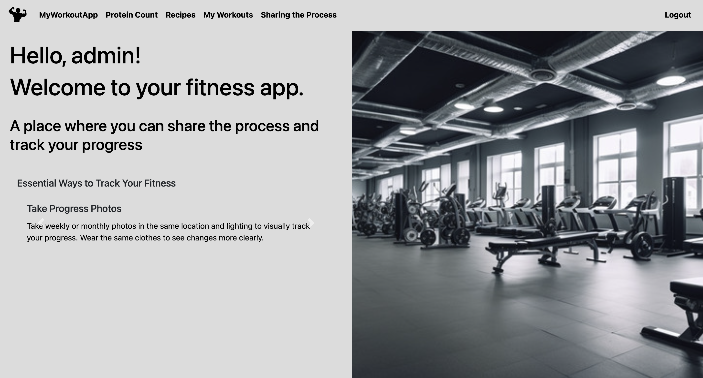
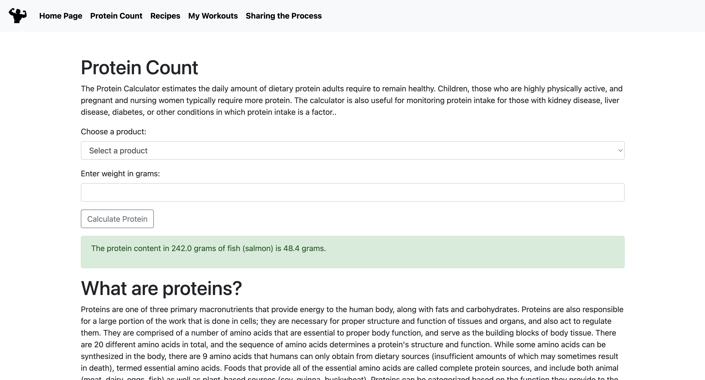
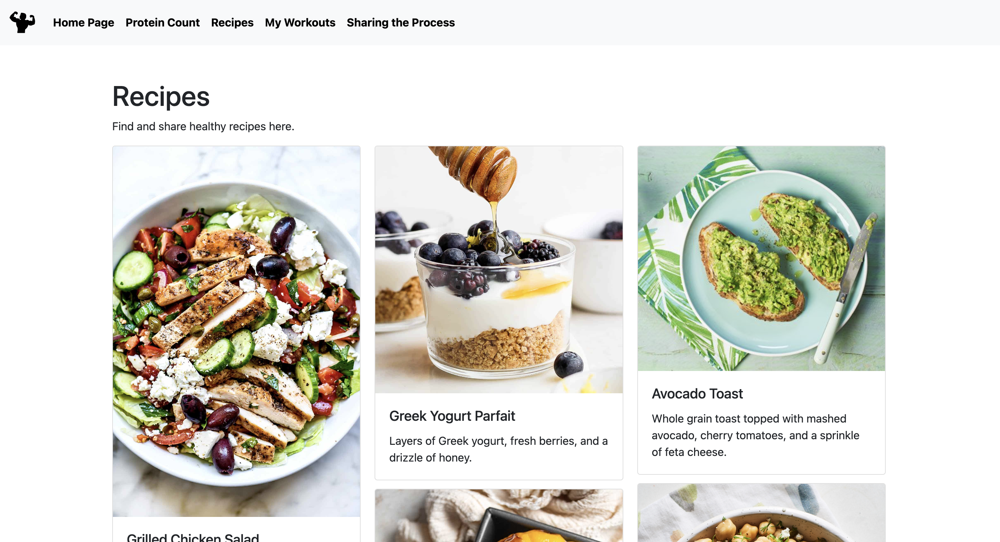
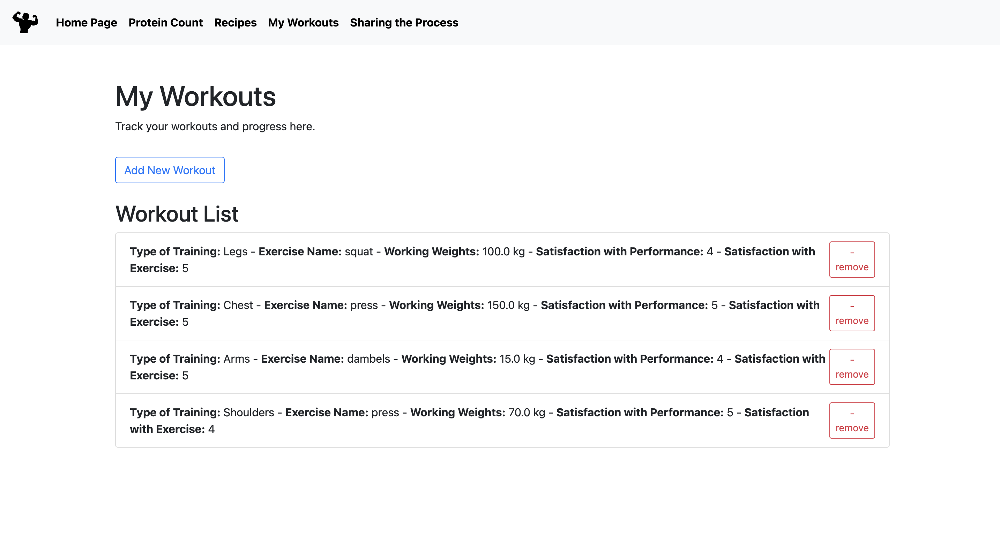
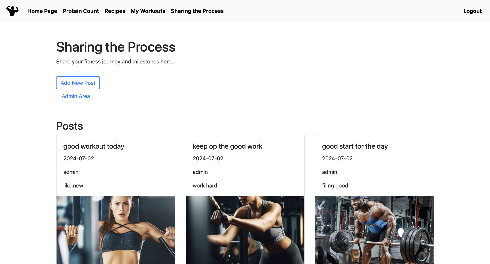
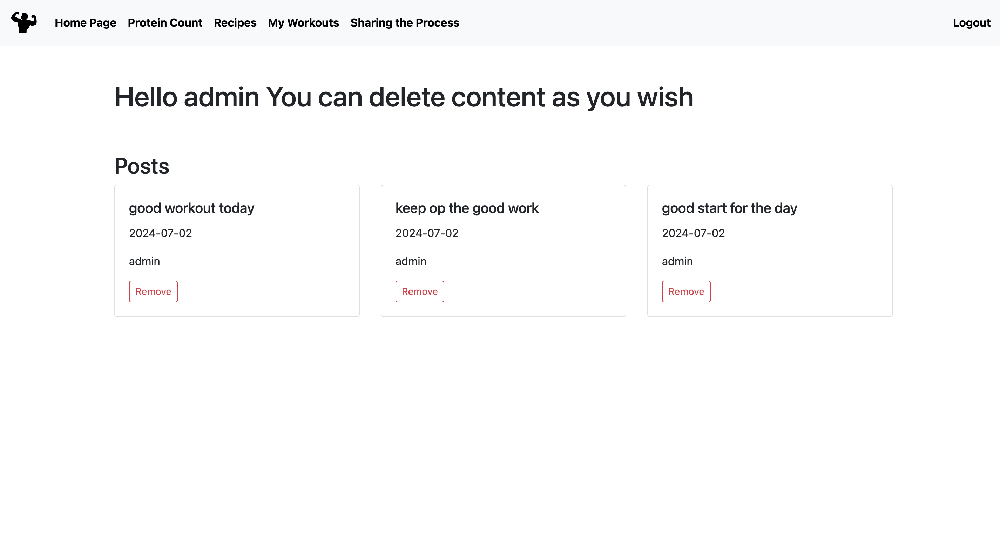
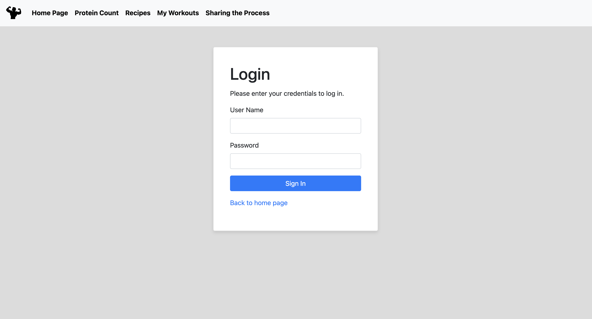

### MyWorkouts APP

## Table of Contents
- [Introduction](#introduction)
- [Image Preview](#image-preview)
- [Overview](#overview)
- [Features](#features)
- [Installation](#installation)
  - [MAMP Setup](#mamp-setup)
  - [Database Configuration](#database-configuration)
  - [Project Configuration](#project-configuration)
  - [Accessing the Application](#accessing-the-application)
- [Usage](#usage)
- [Technologies Used](#technologies-used)
- [Database and Relations](#database-and-relations)
- [Tests](#tests)
- [Security](#security)
- [Contributing](#contributing)

## Introduction
MyWorkouts APP is designed to help users track their training progress, share their fitness journey, and achieve their workout goals through personalized plans and community support.

## Image Preview

| Home Screen | Protein Count Screen| Recipes Screen | My Workouts Courses |
|-------------|------------------|------------------|-------------------------|
|  |  |  |  |

| Sharing the Process | Admin Home Screen | Login |
|--------------------------|-------------------|----------------------|
|  |  |  

## Overview
**MyWorkoutApp** is an innovative and user-friendly fitness application designed to help users achieve their fitness goals through personalized workout plans, nutritional tracking, and progress monitoring. The app is built using modern web technologies and integrates seamlessly with various devices, providing users with a holistic approach to fitness management.

### Key Features

1. **Personalized Workout Plans**:
   - Users can create and customize their workout routines based on their fitness goals, whether it be muscle gain, weight loss, or general fitness.
   - Access to a wide range of exercises with detailed instructions and video demonstrations.

2. **Nutritional Tracking**:
   - Track daily protein intake and other macronutrients to ensure dietary goals are met.
   - Explore and share healthy recipes within the community.

3. **Progress Monitoring**:
   - Track body measurements and weight changes over time.
   - Take and compare progress photos to visually document fitness journey.
   - Monitor strength improvements by recording maximum weights lifted (Rep-Max).

4. **Community Engagement**:
   - Share workout routines, progress photos, and achievements with other users.
   - Participate in discussions and provide support within the 'Sharing the Process' section.

5. **User Authentication and Security**:
   - Secure login and registration system with role-based access control.
   - Different access levels for admins and registered users to manage content and user interactions.

6. **Responsive Design**:
   - Fully responsive layout that adapts to different screen sizes and devices, ensuring a seamless user experience whether on a desktop, tablet, or mobile phone.

7. **Interactive Features**:
   - Integrated fitness carousel highlighting essential fitness tracking tips and resources.
   - Interactive elements such as progress bars, charts, and visual indicators to motivate users and track goals.

## Installation

Before running the MyWorkouts APP, ensure the following configurations:

### MAMP Setup
1. **Create User in MAMP:**
  - Open MAMP and navigate to the MySQL tab.
  - Create a new user with appropriate privileges for the project.

2. **Start the MAMP Application:**
  - Launch the MAMP application.

### Database Configuration
3. **Configure `application.properties`:**
  - Open the file `src/main/resources/application.properties`.
  - For Mac users:
    ```properties
    spring.datasource.username=root
    spring.datasource.password=root
    ```
  - For Windows users:
    ```properties
    spring.datasource.username=root
    spring.datasource.password=
    ```
   (Leave the password blank)

4. **Create Database "ex5":**
  - Open PHPMyAdmin in the MySQL option.
  - Create a new database named 'ex5'.

### Project Configuration
5. **Set SDK for the Project:**
  - Open the project in IntelliJ IDEA.
  - Go to File -> Project Structure -> Project Settings -> Project.
  - Set the SDK to the appropriate Java SDK version.

6. **Run the Project:**
  - Navigate to `src/main/java/hac/Ex5TemplateApplication.java`.
  - Run the application using the running tool in the IDE (e.g., the green 'Run' button).

### Accessing the Application
7. **Access the Application:**
  - Go to `http://localhost:8080/` in your web browser.
  - Use the provided credentials for access.

### Credentials
- **Administrator:**
  - Username: admin
  - Password: password
- **Students:**
  - Multiple users usernames and passwords provided:
    - username: user, password: password
    - username: yehudak@435 password: ykeller

## Usage
### Administrators
- **User Management:**
  - Manage user roles and access levels
  - View user activity and progress
- **Content Management:**
  - Create, update, and delete workouts and recipes
  - Moderate community posts and interactions

### Users
- **Workout Management:**
  - Create and follow personalized workout plans
  - Log workout progress and track achievements
- **Nutritional Tracking:**
  - Monitor daily protein and nutrient intake
  - Share and discover recipes

## Technologies Used
- React
- Spring Boot
- Spring Security
- Spring Data JPA
- Thymeleaf
- Bootstrap
- MySQL
- Maven

## Database and Relations
### Bidirectional Association
We maintain bidirectional associations between `User`, `Workout`, and `Recipe` entities for efficient data access and management.

### Schema - Important Data
- Uniqueness constraint on user progress tracking: `user_id` and `workout_id`.

## Tests
Run tests for various scenarios including user registration, workout logging, nutritional tracking, and validations.

## Security
Utilizes Spring Security for authentication and authorization to ensure restricted access for authorized users.

## Contributing
For contribution guidelines, refer to [CONTRIBUTING.md](CONTRIBUTING.md). Contributions, issues, and feature requests are welcome.
